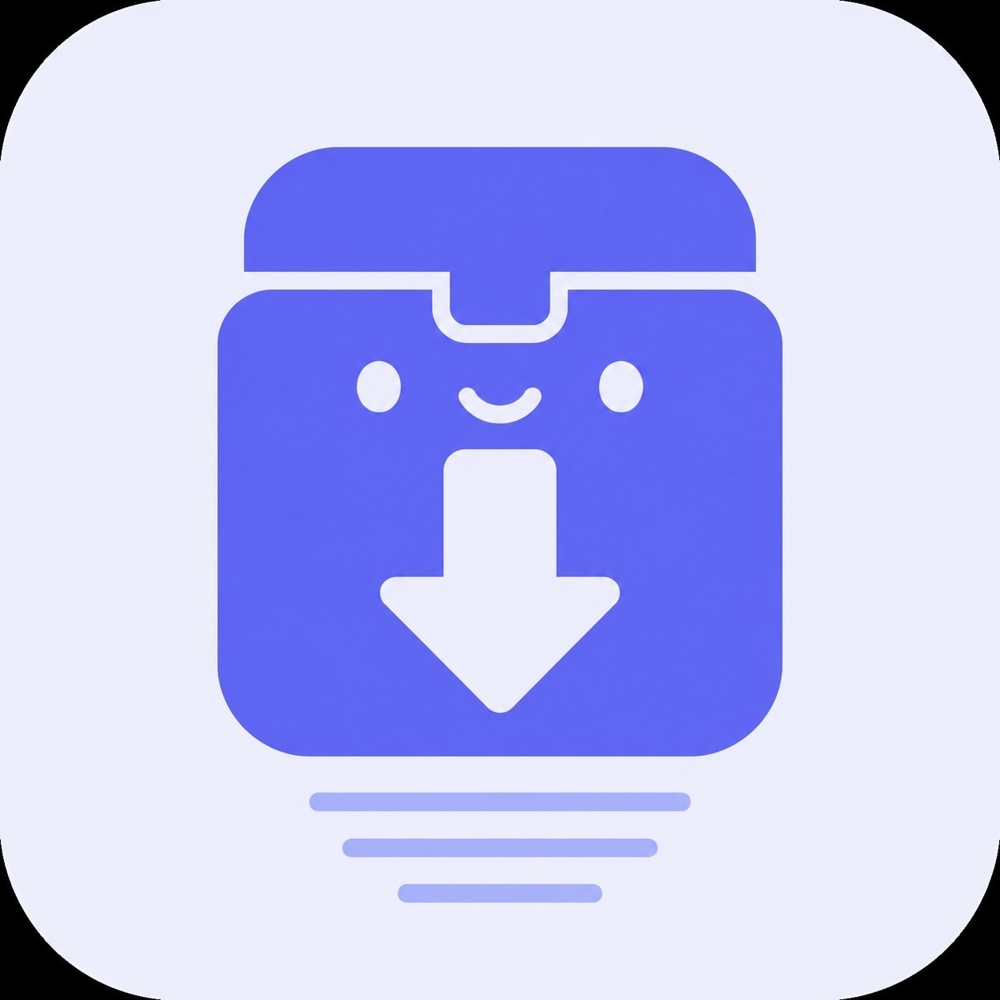

<p align="center">
  
</p>

<h1 align="center">Terabox Downloader Bot</h1>

<p align="center">
  <a href="https://python.org"></a>
  <a href="https://github.com/mocasus/terabox-downloader/blob/main/LICENSE"></a>
  <a href="https://t.me/your_bot"></a>
  
  
</p>

<p align="center">
  Telegram bot untuk mendownload file dari <b>Terabox</b> langsung ke chat kamu.<br>
  Multi-strategy resolver • Dynamic QRIS payment • Auto webhook callback
</p>

<p align="center">
  <a href="#-fitur">Fitur</a> •
  <a href="#-quick-start">Quick Start</a> •
  <a href="#-konfigurasi">Konfigurasi</a> •
  <a href="#-deployment">Deployment</a> •
  <a href="#-pembayaran">Pembayaran</a> •
  <a href="#-arsitektur">Arsitektur</a>
</p>

---

## ✨ Fitur

<table>
<tr>
<td width="50%">

### 🔗 Download Terabox
- Support **semua mirror** Terabox<br>
  (`terabox.com`, `teraboxapp.com`, `mirrobox.com`, dll)
- **Multi-strategy resolver** — auto-fallback
- Progress bar real-time
- Auto-detect tipe file (video, dokumen, arsip)

</td>
<td width="50%">

### 💳 Pembayaran VIP
- **Dynamic QRIS** via KlikQRIS
- Scan → Bayar → VIP langsung aktif
- **Auto webhook callback** — tanpa admin
- Signature verification anti-fraud
- Idempotency mencegah double payment

</td>
</tr>
<tr>
<td width="50%">

### 👑 VIP System
- **Trial mode** (free N downloads)
- VIP per hari atau **Lifetime**
- Auto-expiry check
- Notifikasi real-time

</td>
<td width="50%">

### 🛡️ Admin Panel
- `/pending` — lihat pembayaran pending
- `/approve` / `/reject` — manual override
- `/stats` — statistik bot
- `/broadcast` — kirim pesan ke semua user

</td>
</tr>
</table>

---

## 🚀 Quick Start

### Prasyarat

- Python **3.11+**
- **Telegram Bot Token** dari [@BotFather](https://t.me/BotFather)
- (Opsional) Akun **KlikQRIS** untuk payment gateway

### 1️⃣ Clone & Setup

```bash
git clone https://github.com/mocasus/terabox-downloader.git
cd terabox-downloader

# Create virtualenv
python3 -m venv venv
source venv/bin/activate

# Install dependencies
pip install -r requirements.txt
```

### 2️⃣ Konfigurasi

```bash
# Copy template
cp .env.example .env

# Edit .env — minimal isi BOT_TOKEN + ADMIN_IDS
nano .env
```

### 3️⃣ Run

```bash
# Run bot (will also start webhook server on port 8000)
python bot.py
```

---

## ⚙️ Konfigurasi

### Environment Variables

| Variable | Default | Deskripsi |
|---|---|---|
| **🤖 Bot** | | |
| `BOT_TOKEN` | *(required)* | Token dari @BotFather |
| `ADMIN_IDS` | *(required)* | ID Telegram admin (comma-separated) |
| **👑 VIP** | | |
| `VIP_ENABLED` | `false` | Aktifkan sistem VIP |
| `VIP_PRICE` | `15000` | Harga VIP (IDR) |
| `VIP_DURATION_DAYS` | `30` | Durasi VIP (hari). `0` = lifetime |
| `VIP_TRIAL_ENABLED` | `false` | Aktifkan free trial |
| `VIP_TRIAL_DOWNLOADS` | `3` | Jumlah download gratis |
| **💳 KlikQRIS** | | |
| `KLIKQRIS_API_KEY` | — | API key dari dashboard KlikQRIS |
| `KLIKQRIS_MERCHANT_ID` | — | Merchant ID KlikQRIS |
| `KLIKQRIS_SANDBOX` | `false` | Gunakan mode sandbox untuk testing |
| **🌐 Webhook** | | |
| `WEBHOOK_HOST` | — | Domain publik untuk callback KlikQRIS |
| `WEBHOOK_PORT` | `8000` | Port webhook server |
| **⬇️ Download** | | |
| `MAX_FILE_SIZE_MB` | `50` | Batas maksimum file (Telegram limit: 50MB) |
| `CONCURRENT_DOWNLOADS` | `3` | Concurrent download jobs |
| `DOWNLOAD_DIR` | `/tmp/terabox` | Direktori temporary download |

---

## 🐳 Deployment

### Docker

```bash
# Build & run
docker compose up -d

# View logs
docker compose logs -f
```

### Systemd (VPS)

```bash
sudo tee /etc/systemd/system/terabox-bot.service << 'EOF'
[Unit]
Description=Terabox Downloader Bot
After=network.target

[Service]
Type=simple
User=root
WorkingDirectory=/root/terabox-downloader
ExecStart=/root/terabox-downloader/venv/bin/python bot.py
Restart=always
RestartSec=10

[Install]
WantedBy=multi-user.target
EOF

sudo systemctl daemon-reload
sudo systemctl enable --now terabox-bot
```

---

## 💳 Pembayaran dengan KlikQRIS

### Flow Pembayaran

```
User                Bot              KlikQRIS           User Phone
 │                   │                   │                   │
 │  /bayar           │                   │                   │
 │──────────────────▶│                   │                   │
 │                   │  POST /qris/create│                   │
 │                   │──────────────────▶│                   │
 │                   │◀── QR Image ──────│                   │
 │  🧾 QR Code       │                   │                   │
 │◀──────────────────│                   │                   │
 │                                                 Scan QR   │
 │ ─ ─ ─ ─ ─ ─ ─ ─ ─ ─ ─ ─ ─ ─ ─ ─ ─ ─ ─ ─ ─ ─ ─ ─ ─▶│
 │                                                 Pay ✅    │
 │                   │  Webhook POST     │                   │
 │                   │◀── "PAID" ────────│                   │
 │                   │                   │                   │
 │  ✅ VIP Aktif!    │                   │                   │
 │◀──────────────────│                   │                   │
```

### Setup KlikQRIS

1. **Daftar** di [klikqris.com](https://klikqris.com)
2. **Dapatkan** API Key & Merchant ID dari dashboard
3. **Set webhook URL** di dashboard ke: `https://domain-kamu.com/webhook/klikqris`
4. **Isi `.env`**:
   ```env
   KLIKQRIS_API_KEY=your_api_key
   KLIKQRIS_MERCHANT_ID=your_merchant_id
   WEBHOOK_HOST=https://domain-kamu.com
   WEBHOOK_PORT=8000
   ```

### Testing dengan Sandbox

```env
KLIKQRIS_SANDBOX=true
```

Gunakan [Simulator Sandbox](https://klikqris.com/public/sandbox/simulate) untuk mengetes webhook tanpa transaksi real.

---

## 🏗️ Arsitektur

```
terabox-downloader/
│
├── bot.py                      ← Entry point: Telegram bot + webhook
├── config.py                   ← All settings from .env
│
├── database/
│   ├── models.py               ← SQLite CRUD (users, payments, VIP)
│   └── migrations.py           ← Schema migrations
│
├── terabox/
│   ├── resolver.py             ← Multi-strategy engine
│   ├── downloader.py           ← File download + upload
│   ├── utils.py                ← URL parser & formatter
│   └── strategies/
│       ├── savetube.py         ← Primary: savetube API
│       ├── publicearn.py       ← Fallback (stub)
│       └── direct.py           ← Last resort (stub)
│
├── payments/
│   ├── klikqris.py             ← KlikQRIS API client
│   ├── webhook_server.py       ← aiohttp webhook receiver
│   └── handler.py              ← Payment flow + /bayar command
│
├── admin/
│   ├── handlers.py             ← Admin commands
│   └── stats.py                ← Statistics formatter
│
├── Dockerfile                  ← Docker image
├── docker-compose.yml          ← Docker Compose
├── requirements.txt            ← Python deps
├── .env.example                ← Template konfigurasi
└── README.md                   ← You are here
```

### Tech Stack

| Layer | Tech |
|---|---|
| **Bot Framework** | `python-telegram-bot` v20+ (asyncio) |
| **Database** | SQLite (WAL mode, thread-safe) |
| **Payment** | KlikQRIS API + aiohttp webhook |
| **HTTP** | `aiohttp` (non-blocking) |
| **Deployment** | Docker / systemd |
| **Download** | `aiohttp` stream + `aiofiles` |

---

## 📋 Commands

### User Commands

| Command | Deskripsi |
|---|---|
| `/start` | Mulai bot & registrasi |
| `/help` | Bantuan lengkap |
| `/vip` | Info langganan VIP + tombol bayar |
| `/bayar` | Mulai pembayaran QRIS |
| `/status` | Cek status akun & VIP |

### Admin Commands

| Command | Deskripsi |
|---|---|
| `/pending` | Lihat pembayaran pending |
| `/approve <id>` | Approve pembayaran manual |
| `/reject <id> <alasan>` | Tolak pembayaran |
| `/vipadd <uid> <hari>` | Tambah VIP manual |
| `/viprem <uid>` | Hapus VIP |
| `/vips` | List semua user VIP |
| `/stats` | Statistik bot |
| `/config` | Lihat konfigurasi |
| `/broadcast <msg>` | Kirim broadcast ke semua user |

---

## 🔒 Security

- **Signature verification** — setiap webhook diverifikasi dengan HMAC
- **Idempotency** — mencegah double payment processing
- **Admin-only commands** — semua admin command dilindungi
- **Sandbox mode** — testing tanpa transaksi real
- **No sensitive data in logs** — credentials tidak di-log

---

## 🧩 Extending

### Menambah Strategy Baru

Tambahkan file di `terabox/strategies/`, implement fungsi:

```python
async def resolve(url: str) -> dict | None:
    return {
        "file_name": "...",
        "sizebytes": 123456,
        "direct_link": "https://...",
    }
```

Lalu daftarkan di `terabox/resolver.py`.

### Mengganti Payment Gateway

Payment gateway diisolasi di `payments/klikqris.py`. Ganti provider dengan mengimplementasi interface yang sama:

- `create_transaction(order_id, amount, keterangan)` → `dict`
- `check_status(order_id)` → `dict`
- Webhook handler di `payments/webhook_server.py`

---

## 📄 License

MIT © 2026 [mocasus](https://github.com/mocasus)

---

<p align="center">
  <sub>Built with ❤️ for the community. Star ⭐ if you find it useful!</sub>
</p>
